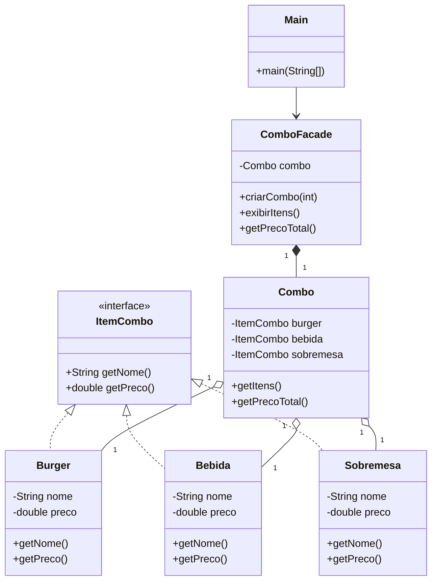

# Atividade – Design Pattern **Facade**  

---

## 1. Objetivo  
Implementar, em **Java (console)**, um sistema simplificado de pedidos “peça‑pelo‑número” para uma lanchonete de fast‑food.  
O aluno deverá:

1. **Aplicar o padrão Facade** para esconder a complexidade da montagem de um combo.  
2. **Utilizar interfaces** para garantir baixo acoplamento e alta coesão entre os componentes do sistema.  

---

## 2. Contexto do Problema  
Na vida real, o atendente oferece números de combos (por exemplo, *Combo 1* ou *Combo 2*). Cada combo contém:  

* 1 sanduíche (burger)  
* 1 bebida  
* 1 sobremesa  

O cliente informa apenas o número; a montagem do pedido completo é responsabilidade do sistema. O **Facade** será responsável por encapsular essa lógica de montagem, expondo uma interface simples ao código cliente (`criarCombo(int codigoCombo)`).

---

## 3. Requisitos de Implementação  

| # | Requisito | Detalhe |
|---|-----------|---------|
| **R1** | **Interface `ItemCombo`** | Deve conter ao menos `String getNome()` e `double getPreco()`. |
| **R2** | **Entidades concretas** | `Burger`, `Bebida`, `Sobremesa` implementam `ItemCombo`. |
| **R3** | **Classe `ComboFacade`** | • método `criarCombo(int codigo)` devolve `Combo` pré‑montado<br> • método `exibirItens()` imprime nomes e preços.<br>• método `getPrecoTotal()` devolve a soma dos preços. |
| **R4** | **Classe `Combo`** | Agrega os três itens; mantém lógica mínima (apenas getters). |
| **R5** | **Cliente (`Main`)** | Oferece menu ao usuário, chama o Facade e exibe o resumo do pedido. |
| **R6** | **Flexibilidade** | Use **interfaces** ou **enums** adicionais se desejar (ex.: `TipoBurger`). |
| **R7** | **Boas práticas** | • Nome de classes e métodos em *camelCase*.<br> • Separe código em pacotes lógicos (`model`, `facade`, `app`). |
| **R8** | **Console‑only** | Nenhuma dependência gráfica. |

---

## 4. Estrutura Sugerida

```text
src/
 └── br/fastfood/
     ├── app/Main.java
     ├── facade/ComboFacade.java
     ├── model/ItemCombo.java
     ├── model/Burger.java
     ├── model/Bebida.java
     ├── model/Sobremesa.java
     └── model/Combo.java
```

---

## 5. Diagrama de Classes da Solução  



---

## 6. Exemplo de Código Inicial  

```java
// model/ItemCombo.java
public interface ItemCombo {
    String getNome();
    double getPreco();
}

// model/Burger.java
public class Burger implements ItemCombo {
    private final String nome;
    private final double preco;

    public Burger(String nome, double preco) {
        this.nome = nome;
        this.preco = preco;
    }
    public String getNome()  { return nome; }
    public double getPreco() { return preco; }
    @Override public String toString() { return nome + " R$" + preco; }
}
```

> **Dica**: crie construtores estáticos ou *factory methods* para itens fixos (por exemplo, `Burger.bigCheddar()`).

---

## 7. Código de Teste (Cliente)  

```java
import java.util.Scanner;
import br.fastfood.facade.ComboFacade;

public class Main {
    public static void main(String[] args) {
        Scanner in = new Scanner(System.in);
        System.out.println("=== Menu de Combos ===");
        System.out.println("1 – Combo Master");
        System.out.println("2 – Super Combo");
        System.out.print("Sua escolha: ");
        int escolha = in.nextInt();

        ComboFacade facade = new ComboFacade();
        facade.criarCombo(escolha);
        facade.exibirItens();
        System.out.printf("Total a pagar: R$ %.2f%n", facade.getPrecoTotal());
    }
}
```

---

## 8. Entrega  

1. Crie um **repositório público no GitHub** ou faça um fork deste repositório
2. Faça *commit* de todo o código‑fonte com a resolução da atividade
3. Envie o **link do repositório** como resposta à atividade.  

*(Mantenha o commit inicial limpo; use mensagens de commit descritivas.)*

---

## 9. Recursos de Apoio  

* Livro *Head First Design Patterns* – Cap. Facade.  
* Oracle Java Tutorials – *Interfaces* e *Packages*.  
* Exemplos de código no repositório oficial da disciplina.  
